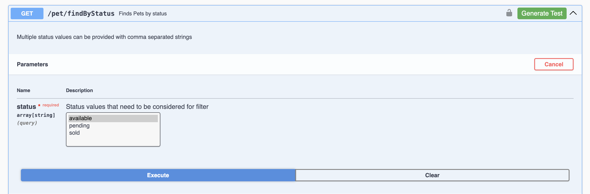
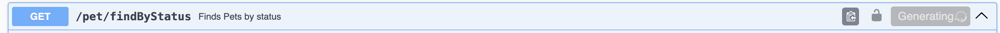
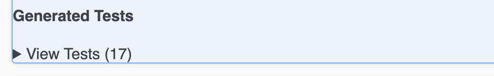
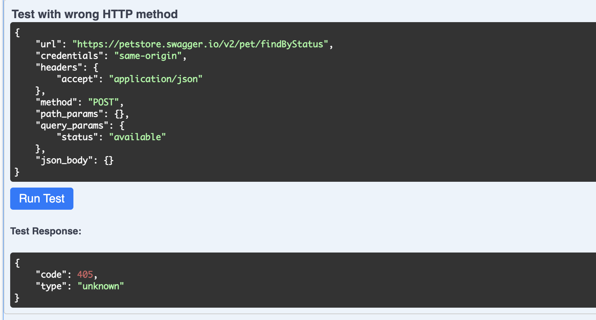
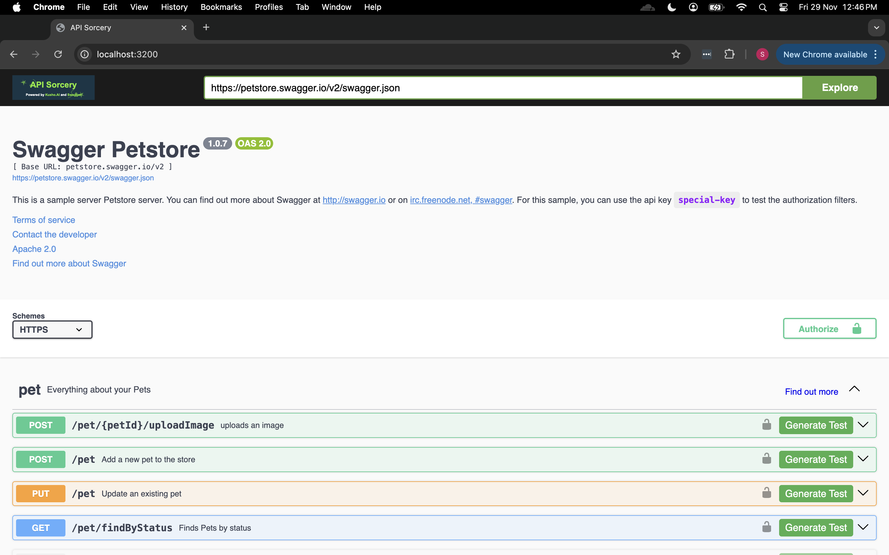

# API Sorcery

API Sorcery is an integrated API testing tool built using Kusho in Swagger. It allows you to easily test and interact with your APIs directly within the Swagger UI interface.

## Introduction

[Swagger UI](https://swagger.io/tools/swagger-ui/) allows anyone — be it your development team or your end consumers — to visualize and interact with the API's resources without having any of the implementation logic in place. It's automatically generated from your OpenAPI (formerly known as Swagger) Specification, with the visual documentation making it easy for back end implementation and client side consumption.

## Compatibility
The OpenAPI Specification has undergone 5 revisions since initial creation in 2010.  Compatibility between Swagger UI and the OpenAPI Specification is as follows:

| Swagger UI Version | Release Date | OpenAPI Spec compatibility             | Notes                                                                 |
|--------------------|--------------|----------------------------------------|-----------------------------------------------------------------------|
| 5.0.0              | 2023-06-12   | 2.0, 3.0.0, 3.0.1, 3.0.2, 3.0.3, 3.1.0 | [tag v5.0.0](https://github.com/swagger-api/swagger-ui/tree/v5.0.0)   |
| 4.0.0              | 2021-11-03   | 2.0, 3.0.0, 3.0.1, 3.0.2, 3.0.3        | [tag v4.0.0](https://github.com/swagger-api/swagger-ui/tree/v4.0.0)   |
| 3.18.3             | 2018-08-03   | 2.0, 3.0.0, 3.0.1, 3.0.2, 3.0.3        | [tag v3.18.3](https://github.com/swagger-api/swagger-ui/tree/v3.18.3) |
| 3.0.21             | 2017-07-26   | 2.0                                    | [tag v3.0.21](https://github.com/swagger-api/swagger-ui/tree/v3.0.21) |
| 2.2.10             | 2017-01-04   | 1.1, 1.2, 2.0                          | [tag v2.2.10](https://github.com/swagger-api/swagger-ui/tree/v2.2.10) |
| 2.1.5              | 2016-07-20   | 1.1, 1.2, 2.0                          | [tag v2.1.5](https://github.com/swagger-api/swagger-ui/tree/v2.1.5)   |
| 2.0.24             | 2014-09-12   | 1.1, 1.2                               | [tag v2.0.24](https://github.com/swagger-api/swagger-ui/tree/v2.0.24) |
| 1.0.13             | 2013-03-08   | 1.1, 1.2                               | [tag v1.0.13](https://github.com/swagger-api/swagger-ui/tree/v1.0.13) |
| 1.0.1              | 2011-10-11   | 1.0, 1.1                               | [tag v1.0.1](https://github.com/swagger-api/swagger-ui/tree/v1.0.1)   |

## How to Use

1. **Execute an API**: Navigate to the API you want to test. Click the "Execute" button to send the request and view the response.



2. **Generate a Test**: After executing the API, click the "Generate Test" button next to the API endpoint.



3. **View Test Results**: The test results will be displayed at the bottom of the page. Click on the "View Tests" section to see the details of the generated test.



4. **Run the Test**: With the test results displayed, click the "Generate Test" button to run the test.



By integrating the Kusho testing framework directly into the Swagger UI, API Sorcery provides a seamless way to test and interact with your APIs. The generated tests can be used for ongoing monitoring and validation of your API's behavior.

## Features

- **Integrated Testing**: Execute APIs and generate tests directly within the Swagger UI.
- **Comprehensive Test Generation**: API Sorcery automatically creates comprehensive test cases based on the API specification.
- **Test Execution**: Run the generated tests to validate your API's behavior and ensure it meets the expected requirements.
- **Visual Feedback**: The test results are displayed in a clear and easy-to-understand format, providing valuable insights into your API's performance.

## Getting Started

To use API Sorcery, simply navigate to your Swagger UI and take advantage of the "Generate Test" functionality for each API endpoint. The tool will guide you through the process of testing your APIs and visualizing the results.



For more information and support, please refer to the project's documentation or reach out to the development team.

## Anonymized analytics

SwaggerUI uses [Scarf](https://scarf.sh/) to collect [anonymized installation analytics](https://github.com/scarf-sh/scarf-js?tab=readme-ov-file#as-a-user-of-a-package-using-scarf-js-what-information-does-scarf-js-send-about-me). These analytics help support the maintainers of this library and ONLY run during installation. To [opt out](https://github.com/scarf-sh/scarf-js?tab=readme-ov-file#as-a-user-of-a-package-using-scarf-js-how-can-i-opt-out-of-analytics), you can set the `scarfSettings.enabled` field to `false` in your project's `package.json`:

```
// package.json
{
  // ...
  "scarfSettings": {
    "enabled": false
  }
  // ...
}
```

Alternatively, you can set the environment variable `SCARF_ANALYTICS` to `false` as part of the environment that installs your npm packages, e.g., `SCARF_ANALYTICS=false npm install`.

## Documentation

#### Usage
- [Installation](https://github.com/swagger-api/swagger-ui/blob/HEAD/docs/usage/installation.md)
- [Configuration](https://github.com/swagger-api/swagger-ui/blob/HEAD/docs/usage/configuration.md)
- [CORS](https://github.com/swagger-api/swagger-ui/blob/HEAD/docs/usage/cors.md)
- [OAuth2](https://github.com/swagger-api/swagger-ui/blob/HEAD/docs/usage/oauth2.md)
- [Deep Linking](https://github.com/swagger-api/swagger-ui/blob/HEAD/docs/usage/deep-linking.md)
- [Limitations](https://github.com/swagger-api/swagger-ui/blob/HEAD/docs/usage/limitations.md)
- [Version detection](https://github.com/swagger-api/swagger-ui/blob/HEAD/docs/usage/version-detection.md)

#### Customization
- [Overview](https://github.com/swagger-api/swagger-ui/blob/HEAD/docs/customization/overview.md)
- [Plugin API](https://github.com/swagger-api/swagger-ui/blob/HEAD/docs/customization/plugin-api.md)
- [Custom layout](https://github.com/swagger-api/swagger-ui/blob/HEAD/docs/customization/custom-layout.md)

#### Development
- [Setting up](https://github.com/swagger-api/swagger-ui/blob/HEAD/docs/development/setting-up.md)
- [Scripts](https://github.com/swagger-api/swagger-ui/blob/HEAD/docs/development/scripts.md)

#### Contributing
- [Contributing](https://github.com/swagger-api/.github/blob/HEAD/CONTRIBUTING.md)

##### Integration Tests

You will need JDK of version 7 or higher as instructed here
https://nightwatchjs.org/guide/getting-started/installation.html#install-selenium-server

Integration tests can be run locally with `npm run e2e` - be sure you aren't running a dev server when testing!

### Browser support
Swagger UI works in the latest versions of Chrome, Safari, Firefox, and Edge.

### Known Issues

To help with the migration, here are the currently known issues with 3.X. This list will update regularly, and will not include features that were not implemented in previous versions.

- Only part of the parameters previously supported are available.
- The JSON Form Editor is not implemented.
- Support for `collectionFormat` is partial.
- l10n (translations) is not implemented.
- Relative path support for external files is not implemented.

## Security contact

Please disclose any security-related issues or vulnerabilities by emailing [security@swagger.io](mailto:security@swagger.io), instead of using the public issue tracker.

## License

SwaggerUI is licensed under [Apache 2.0 license](https://github.com/swagger-api/swagger-ui/blob/master/LICENSE).
SwaggerUI comes with an explicit [NOTICE](https://github.com/swagger-api/swagger-ui/blob/master/NOTICE) file
containing additional legal notices and information.
